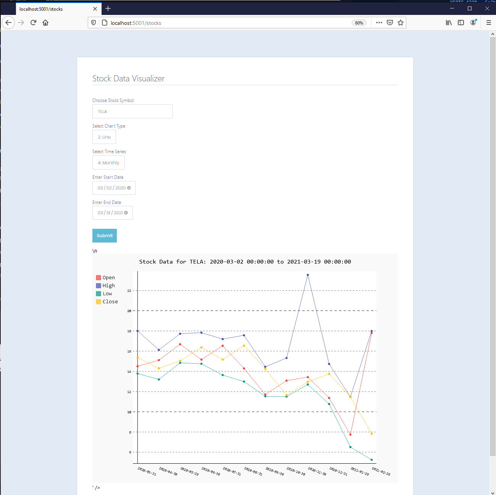

# Stock Data Visualizer as a Web Application

## What is it?
This is an addition to the previously completed Stock Data Visualizer project that our Scrum Team Completed within 3 sprints.

Here is a list of the resources and tools used...
- [Docker Container](https://www.docker.com/resources/what-container) 
- [Flask API](https://programminghistorian.org/en/lessons/creating-apis-with-python-and-flask)
- Python
-  [Jinja](https://jinja.palletsprojects.com/en/2.11.x/)

### How does it work?
Once you have gotten the project file zipped and you have Docker installed on your machine, follow the steps below...


### Step 1: Initialize the Docker Container so you can load the App in a Browser
---
1. Download the zip file from this GitHub Repo. Go into the “it-4320-project3a” folder and you will see the following files and folders:
    - docker-compose.yml
    - Dockerfile
    - config.py (Links to an external site.)
    - requirements.txt 
    - wsgi.py (Links to an external site.)
    - LISCENCE
    - flask_wtforms_tutorial (folder)
2. From your terminal (Mac) or command line (PC) go into “it-4320-project3a” folder and type the following command
```
docker-compose up -d
```
3. The previous step would have run the docker-compose.yml and Dockerfile files to create the Docker container and Flask app. You can check to ensure that your container was created by looking at your Docker dashboard, or typing the following.
```
docker ps -a
```
4. You can view the application running in the web browser by going to the following url
```
http://0.0.0.0:5001/
```
5. To stop your container and application from running type the following command.
```
docker-compose down
```

** The above content was gotten from Kristoferson's Canvas Course **


### Step 2: Get to the Web App
--- 

On you preferred web browser, in the URL type in 
```
http://localhost:5001/
```
On certain machines, it may be port 5000. You can do this easier by going in your docker app and clicking on 'Open in Browser'.


### Step 3: Fill out the Form and Submit
---

The next step is to fill out the information on the form.

- Choose Stock Symbol
    - Choose from the list of the stock symbols (which was dynamically populated by me)
- Select Chart Type
    - List of two options, a **Bar Chart** or a **Line Chart**
- Select Time Series
    - List of four options, **Intraday**, **Daily**, **Weekly**, or **Monthly**
    - **NOTE**: If the Intraday option is selected, it will only take into account the end date
- Enter Start Date
    - Choose a start date depending on your desired date range
- Enter End Date
    - Choose an end date depending on your desired date range
    - **Note**: If you select a date that is earlier than the beginning date, there will be an error when you submit the form.

Now all you have to do is hit "Submit" and the chart data will populate depending on what you chose as a time-series. 

**NOTE**: If you are a chrome user, an API error will output saying that the data entered is wrong. I am still working on what this issue may be.


### Some examples:

These are some examples that I have provided to see what the line chart 

**Intraday**


---
**Daily**


---
**Weekly**


---
**Monthly**
